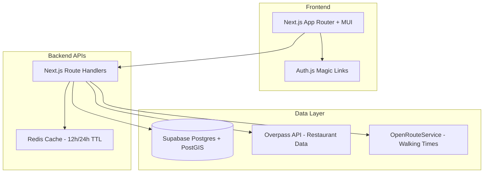

# Team Lunch App - Technical Design

## Architecture Overview


## Tech Stack Decisions
- **Platform**: Next.js (App Router) + TypeScript + MUI
- **Hosting**: Vercel (EU region)
- **Database**: Supabase Postgres + PostGIS (EU region)
- **Cache**: Upstash Redis (EU region)
- **Authentication**: Auth.js email magic links only
- **External APIs**: OSM/Overpass + OpenRouteService (Germany-first)

## Data Model
```sql
-- Core entities with PostGIS support
users (id, email, name, dietary_tags[])
teams (id, name, meeting_point geography, settings jsonb)
team_members (team_id, user_id, role)
restaurants (id, provider, provider_id, name, location geography, cuisine_tags[])
polls (id, team_id, status, close_time, constraints_json, winner_restaurant_id)
poll_suggestions (poll_id, restaurant_id, suggested_by)
poll_votes (poll_id, user_id, restaurant_id) -- multiple votes per user allowed
team_restaurants (team_id, restaurant_id, last_visited_at, times_visited)
reviews (poll_id, restaurant_id, user_id, rating, comment)
```

## Key Design Patterns

### Voting Logic
- Users can upvote multiple restaurants (one vote per restaurant)
- Only aggregate totals visible during polls
- Hard max-walk filter applied at winner selection
- Ties resolved randomly with stored seed

### Caching Strategy
- Restaurant search results: 12-hour Redis TTL
- Walking time calculations: 24-hour Redis TTL  
- Rate limiting: 60 requests/minute per user for external APIs

### Graceful Degradation
- Fallback to straight-line distance (4.5 km/h) when ORS fails
- Serve stale cached results with "stale" badge when Overpass unavailable
- Include unknown walking times in winner selection (MVP)

### Security & Privacy
- RBAC on all API routes (team membership required)
- Dietary tags visible only to team members
- Signed, time-limited invite tokens
- EU-first data residency for GDPR compliance